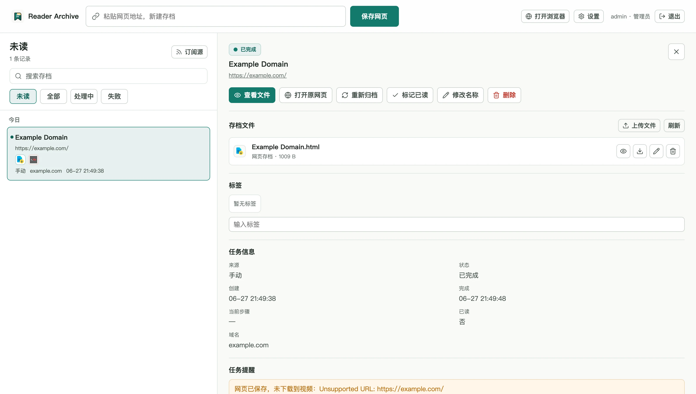
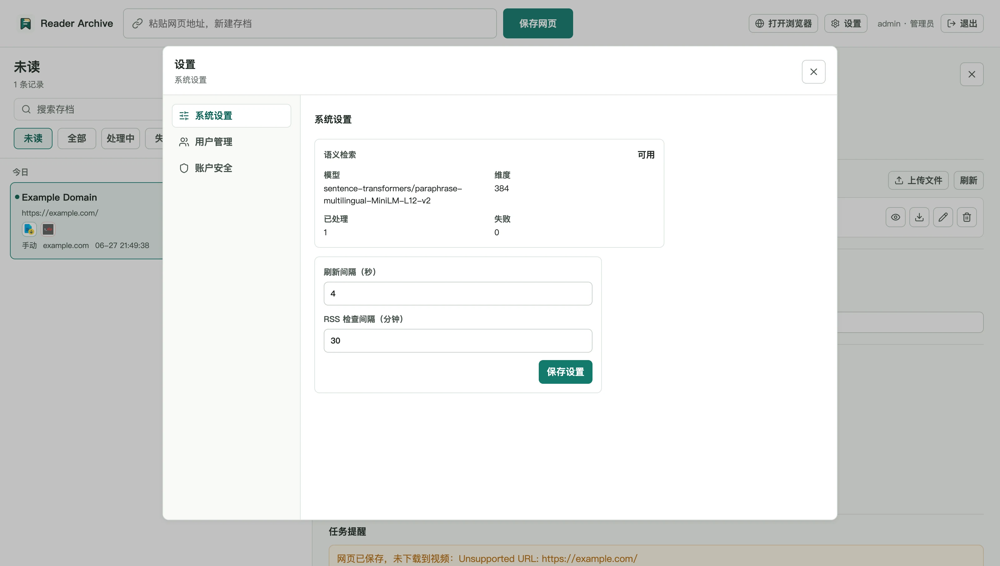
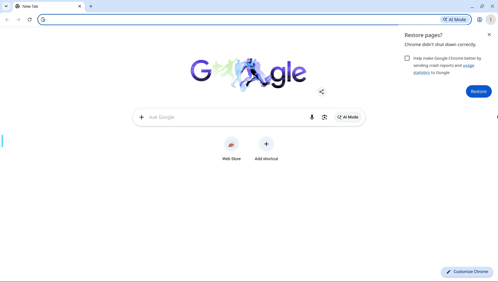

# Reader Archive

Reader Archive is a self-hosted web archiver for saving pages, files, RSS articles, and public videos.

It packages a web app, an API service, PostgreSQL, SingleFile, yt-dlp, and a browser desktop into one Docker Compose setup. The goal is to keep a private searchable reading archive that you can run on a home server.

## Screenshots

### Archive list and details



### Settings



### Browser desktop



## Features

- Save web pages as local archives.
- Download public videos when yt-dlp supports the source.
- Add RSS feeds and archive new articles automatically.
- Search saved items by title, source, tag, status, and semantic meaning.
- Manage saved files attached to each archived item.
- Open a protected browser desktop for sites that need manual login.
- Keep archive files and browser data in local folders for backup.

## Requirements

- Docker and Docker Compose.
- A machine that can run the LinuxServer Chrome image.
- Enough disk space for browser data, saved pages, downloaded videos, and PostgreSQL data.

The image currently builds for `linux/amd64`. On Apple Silicon, Docker will run it through emulation.

## Quick Start

Create a folder for Reader Archive:

```bash
mkdir reader-archive
cd reader-archive
```

Download the Compose file and environment template:

```bash
curl -L -o compose.yaml https://raw.githubusercontent.com/raikiriww/ReaderArchive/main/compose.yaml
curl -L -o .env https://raw.githubusercontent.com/raikiriww/ReaderArchive/main/.env.example
```

Edit `.env` before exposing the app beyond your own machine:

```bash
READER_POSTGRES_PASSWORD=change-this-database-password
READER_SECRET_KEY=change-this-reader-secret-key
READER_BOOTSTRAP_ADMIN_USERNAME=admin
READER_BOOTSTRAP_ADMIN_PASSWORD=change-this-admin-password
```

Create the local data directories:

```bash
mkdir -p data/archive data/browser/config data/postgres
```

On Linux, also set the desktop file owner values in `.env` to your numeric user
and group IDs. Check them with:

```bash
id -u
id -g
```

Then put those numbers in `.env`.

You can generate a stronger secret key with:

```bash
openssl rand -hex 32
```

Start the app:

```bash
docker compose pull
docker compose up -d
```

Open:

```text
http://localhost:38165
```

Sign in with the admin username and password from `.env`. The first admin user is created only when the database has no users.

## Data

Runtime data is stored under `data/`:

- `data/archive`: saved pages, uploaded files, and downloaded media.
- `data/browser`: browser profile and session data.
- `data/postgres`: PostgreSQL database files.

The PostgreSQL container owns the database files. `READER_DESKTOP_PUID` and
`READER_DESKTOP_PGID` control the desktop and archive file owner, not the
database process.

The app container makes the archive and browser profile folders writable for the
configured desktop user when it starts.

Back up the whole `data/` folder if you want to preserve the archive.
Browser login state is stored under
`data/browser/config/.config/reader-archive-profile`.

## Browser Desktop

After signing in, open:

```text
http://localhost:38165/browser/
```

The browser desktop is available through Reader Archive and is protected by the app login. Raw desktop ports are not published by Docker.
The visible browser desktop and the archiver share the same browser session.
Sign in or pass browser checks from the desktop when a site needs it, then
archive the page normally.

## Configuration

Common settings in `.env`:

```bash
READER_API_PORT=38165
READER_IMAGE=ghcr.io/raikiriww/readerarchive:latest
READER_POSTGRES_PASSWORD=change-this-database-password
READER_SECRET_KEY=change-this-reader-secret-key
READER_BOOTSTRAP_ADMIN_USERNAME=admin
READER_BOOTSTRAP_ADMIN_PASSWORD=change-this-admin-password
READER_APP_DATA_DIR=./data
READER_ARCHIVE_DIR=./data/archive
READER_BROWSER_PROFILE_DIR=./data/browser/config
READER_POSTGRES_DIR=./data/postgres
READER_SEMANTIC_SEARCH_ENABLED=true
```

On Linux, set these to your local user and group so browser and archive files are owned correctly:

```bash
id -u
id -g
```

Then update:

```bash
READER_DESKTOP_PUID=1000
READER_DESKTOP_PGID=1000
```

## Verification

Run the full Docker verification from a source checkout:

```bash
scripts/verify_in_docker.sh
```

The script builds the image with `compose.build.yaml`, restarts the containers, checks the API, runs backend tests in Docker, regenerates the frontend client in Docker, runs frontend checks in Docker, runs frontend tests in Docker, and leaves the project containers running.

## Building From Source

The default `compose.yaml` is for users and pulls the published image. To build locally from a source checkout, include the build override:

```bash
docker compose -f compose.yaml -f compose.build.yaml build archive-desktop
docker compose -f compose.yaml -f compose.build.yaml up -d
```

You can override tool versions while building:

```bash
SINGLE_FILE_CLI_VERSION=2.0.83 YT_DLP_VERSION=2026.06.09 \
  docker compose -f compose.yaml -f compose.build.yaml build archive-desktop
```

Published images are built for `linux/amd64` and pushed to:

```text
ghcr.io/raikiriww/readerarchive
```

## Releases

Docker images are published by GitHub Actions after the Docker verification
passes. Version tags such as `v0.1.0` publish both `v0.1.0` and `0.1.0` image
tags. The `main` branch publishes `latest`.

After the first successful release, open the `readerarchive` package in GitHub
Packages and change its visibility to public. The release workflow checks
anonymous image access and fails with a clear message if the package is still
private.

## Updating

Pull the latest image and restart:

```bash
docker compose pull
docker compose up -d
```

Database migrations run automatically when the API starts.

## Security Notes

- Change the default admin password before real use.
- Change `READER_SECRET_KEY` before real use.
- Put the app behind HTTPS, VPN, or a trusted reverse proxy before exposing it to a network you do not fully control.
- Browser cookies and sessions are stored in `data/browser`.
- yt-dlp does not reuse the protected browser desktop login state.

## API

The API is available under:

```text
http://localhost:38165/api/v1
```

Health check:

```bash
curl http://localhost:38165/api/v1/health
```

The development verification script runs its health check from inside the app
container, so its default internal address is `http://127.0.0.1:8000`.

## License

Reader Archive source code is licensed under the Apache License 2.0. See `LICENSE`.

This project depends on third-party software, images, packages, models, and tools.
Those components remain licensed by their original authors under their own licenses.
See `THIRD_PARTY_NOTICES.md` for details.
