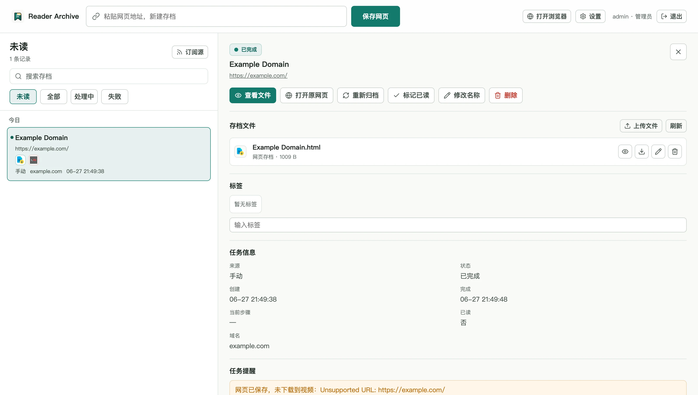
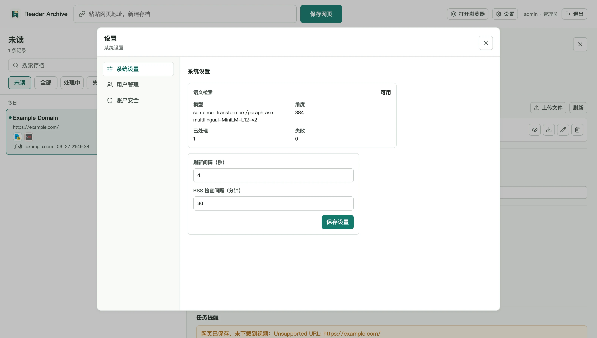
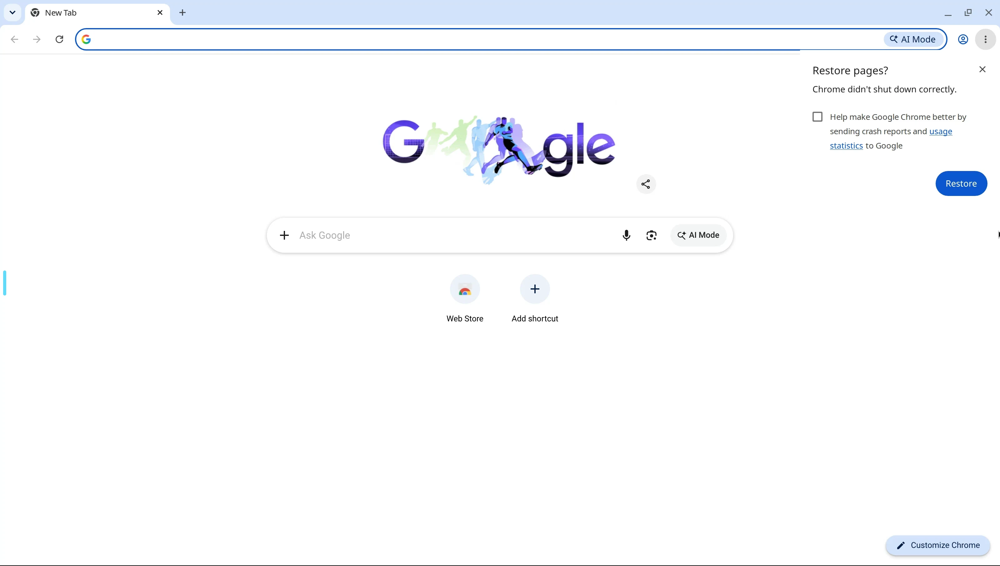

# Reader Archive

Reader Archive is a self-hosted web archiver for saving pages, files, RSS articles, and public videos.

It packages a web app, an API service, PostgreSQL, SingleFile, yt-dlp, and a browser desktop into one Docker Compose setup. The goal is to keep a private searchable reading archive that you can run on a home server.

## Screenshots

### Archive list and details



### Settings



### Browser desktop



## Features

- Save web pages as local archives.
- Download public videos when yt-dlp supports the source.
- Add RSS feeds and archive new articles automatically.
- Search all saved items by title, original text, tags, URL, or a description; narrow by type, source, date, and read state.
- Manage saved files attached to each archived item.
- Open a protected browser desktop for sites that need manual login.
- Keep archive files and browser data in local folders for backup.

## Preparing a page before saving

Check **保存前手动处理** beside the URL field to open a page and wait before
saving. Open the task's **切回处理页面** button to use the built-in browser,
close popups, expand quotations, or load the content you need. Then click
**处理完成，保存当前页面**. Reader captures that same tab without reloading
it. The checkbox applies to one submission and resets afterward.

Waiting does not use the archive timeout or block other queued saves. Closing
Reader's UI does not discard the waiting task. If its browser tab is lost,
explicitly reopen it and repeat your changes before continuing. A failed page
capture keeps the prepared tab available for another attempt. **取消等待**
closes the task's tab and, after confirmation, deletes the task and its files.
Normal automatic saves and RSS imports keep their existing behavior.

## Finding saved content

The address field at the top still saves a page directly. Choose **搜索存档**
or press **Cmd/Ctrl+K** to search without interrupting a save. Search includes
read items by default; filters make the current scope explicit.

Results show the actual matching text. Open a preview, read the extracted
original text at the match, or open the original archive with its images and
layout. Returning to results preserves your place. Identical saved URLs are
grouped with links to their available versions; URLs with different query
parameters remain separate.

Choose **只匹配原词** to require the entered words, or put an exact phrase in
quotes. Content found only by similar meaning is labeled separately and may
not answer the question. Recent searches stay in the current browser session
and can be cleared.

Full-text keyword search remains available when the local model is disabled,
starting, or busy. Existing archives are prepared in the background after an
upgrade. The page reports missing or pending text; scanned PDFs and videos
without extracted text do not gain OCR or transcript search through this update.
The default upgrade uses the existing database and does not require new Compose
settings.

The default CPU search combines Chinese/English keyword matching with
Qwen3-Embedding-0.6B and BGE-reranker-v2-m3. No dedicated GPU is required.
Models are included in the image; the first upgrade rebuilds search data in
the background while keyword search stays available. Explicit legacy MiniLM
configurations retain their model directory and index version. Allow additional
memory for the two models; actual local verification used about 5 GiB for the
application process, and startup on other CPU paths can use more.

Implementation and measured limits are recorded in
[the backend upgrade notes](docs/search-backend-upgrade.md) and
[the search evaluation](docs/search-upgrade-evaluation.md).
CPU model selection and final verification are recorded in
[the CPU upgrade notes](docs/search-cpu-upgrade.md).

## Requirements

- Docker and Docker Compose.
- A machine that can run the LinuxServer Chrome image.
- Enough disk space for browser data, saved pages, downloaded videos, and PostgreSQL data.

The image currently builds for `linux/amd64`. On Apple Silicon, Docker will run it through emulation.

## Quick Start

Create a folder for Reader Archive:

```bash
mkdir reader-archive
cd reader-archive
```

Download the Compose file and environment template:

```bash
curl -L -o compose.yaml https://raw.githubusercontent.com/raikiriww/ReaderArchive/main/compose.yaml
curl -L -o .env https://raw.githubusercontent.com/raikiriww/ReaderArchive/main/.env.example
```

Edit `.env` before exposing the app beyond your own machine:

```bash
READER_POSTGRES_PASSWORD=change-this-database-password
READER_SECRET_KEY=change-this-reader-secret-key
READER_BOOTSTRAP_ADMIN_USERNAME=admin
READER_BOOTSTRAP_ADMIN_PASSWORD=change-this-admin-password
```

Create the local data directories:

```bash
mkdir -p data/archive data/browser/config data/postgres
```

On Linux, also set the desktop file owner values in `.env` to your numeric user
and group IDs. Check them with:

```bash
id -u
id -g
```

Then put those numbers in `.env`.

You can generate a stronger secret key with:

```bash
openssl rand -hex 32
```

Start the app:

```bash
docker compose pull
docker compose up -d
```

Open:

```text
http://localhost:38165
```

Sign in with the admin username and password from `.env`. The first admin user is created only when the database has no users.

## Data

Runtime data is stored under `data/`:

- `data/archive`: saved pages, uploaded files, and downloaded media.
- `data/browser`: browser profile and session data.
- `data/postgres`: PostgreSQL database files.

The PostgreSQL container owns the database files. `READER_DESKTOP_PUID` and
`READER_DESKTOP_PGID` control the desktop and archive file owner, not the
database process.

The app container makes the archive and browser profile folders writable for the
configured desktop user when it starts.

Back up the whole `data/` folder if you want to preserve the archive.
Browser login state is stored under
`data/browser/config/.config/reader-archive-profile`.

## Browser Desktop

After signing in, open:

```text
http://localhost:38165/browser/
```

The browser desktop is available through Reader Archive and is protected by the app login. Raw desktop ports are not published by Docker.
The visible browser desktop and the archiver share the same browser session.
Sign in or pass browser checks from the desktop when a site needs it, then
archive the page normally.

## Configuration

Common settings in `.env`:

```bash
READER_API_PORT=38165
READER_IMAGE=ghcr.io/raikiriww/readerarchive:latest
READER_POSTGRES_PASSWORD=change-this-database-password
READER_SECRET_KEY=change-this-reader-secret-key
READER_BOOTSTRAP_ADMIN_USERNAME=admin
READER_BOOTSTRAP_ADMIN_PASSWORD=change-this-admin-password
READER_APP_DATA_DIR=./data
READER_ARCHIVE_DIR=./data/archive
READER_BROWSER_PROFILE_DIR=./data/browser/config
READER_POSTGRES_DIR=./data/postgres
READER_SEMANTIC_SEARCH_ENABLED=true
```

On Linux, set these to your local user and group so browser and archive files are owned correctly:

```bash
id -u
id -g
```

Then update:

```bash
READER_DESKTOP_PUID=1000
READER_DESKTOP_PGID=1000
```

## Verification

Run the full Docker verification from a source checkout:

```bash
scripts/verify_in_docker.sh
```

The script builds the image with `compose.build.yaml`, restarts the containers, checks the API, runs backend tests in Docker, regenerates the frontend client in Docker, runs frontend checks in Docker, runs frontend tests in Docker, and leaves the project containers running.

## Building From Source

The default `compose.yaml` is for users and pulls the published image. To build locally from a source checkout, include the build override:

```bash
docker compose -f compose.yaml -f compose.build.yaml build archive-desktop
docker compose -f compose.yaml -f compose.build.yaml up -d
```

You can override tool versions while building:

```bash
SINGLE_FILE_CLI_VERSION=2.6.1 YT_DLP_VERSION=2026.06.09 \
  docker compose -f compose.yaml -f compose.build.yaml build archive-desktop
```

Published images are built for `linux/amd64` and pushed to:

```text
ghcr.io/raikiriww/readerarchive
```

## Releases

Docker images are published by GitHub Actions after the Docker verification
passes. Pull requests run the full verification without publishing an image.
Merging to `main` does not publish an image. Version tags such as `v0.1.0`
build and verify the image once, then publish that same image as `latest`,
`v0.1.0`, `0.1.0`, and a commit-specific `sha-*` tag.

After the first successful release, open the `readerarchive` package in GitHub
Packages and change its visibility to public. The release workflow checks
anonymous image access and fails with a clear message if the package is still
private.

## Updating

Pull the latest image and restart:

```bash
docker compose pull
docker compose up -d
```

Database migrations run automatically when the API starts.

Page loading now defaults to 120 seconds, while the complete page archive job
allows 240 seconds so capture can finish after loading. The application supplies
these defaults itself. Existing `.env` or Compose values still override them;
older Compose files supply the former 20-second load limit and 120-second job
limit. To adopt the new limits with an older Compose file, set these in `.env`
before running `docker compose up -d` (no Compose replacement is needed):

```bash
READER_BROWSER_LOAD_MAX_TIME_MS=120000
READER_ARCHIVE_TIMEOUT_SECONDS=240
```

## Security Notes

- Change the default admin password before real use.
- Change `READER_SECRET_KEY` before real use.
- Put the app behind HTTPS, VPN, or a trusted reverse proxy before exposing it to a network you do not fully control.
- Browser cookies and sessions are stored in `data/browser`.
- yt-dlp does not reuse the protected browser desktop login state.

## API

The API is available under:

```text
http://localhost:38165/api/v1
```

Health check:

```bash
curl http://localhost:38165/api/v1/health
```

The development verification script runs its health check from inside the app
container, so its default internal address is `http://127.0.0.1:8000`.

## License

Reader Archive source code is licensed under the Apache License 2.0. See `LICENSE`.

This project depends on third-party software, images, packages, models, and tools.
Those components remain licensed by their original authors under their own licenses.
See `THIRD_PARTY_NOTICES.md` for details.
